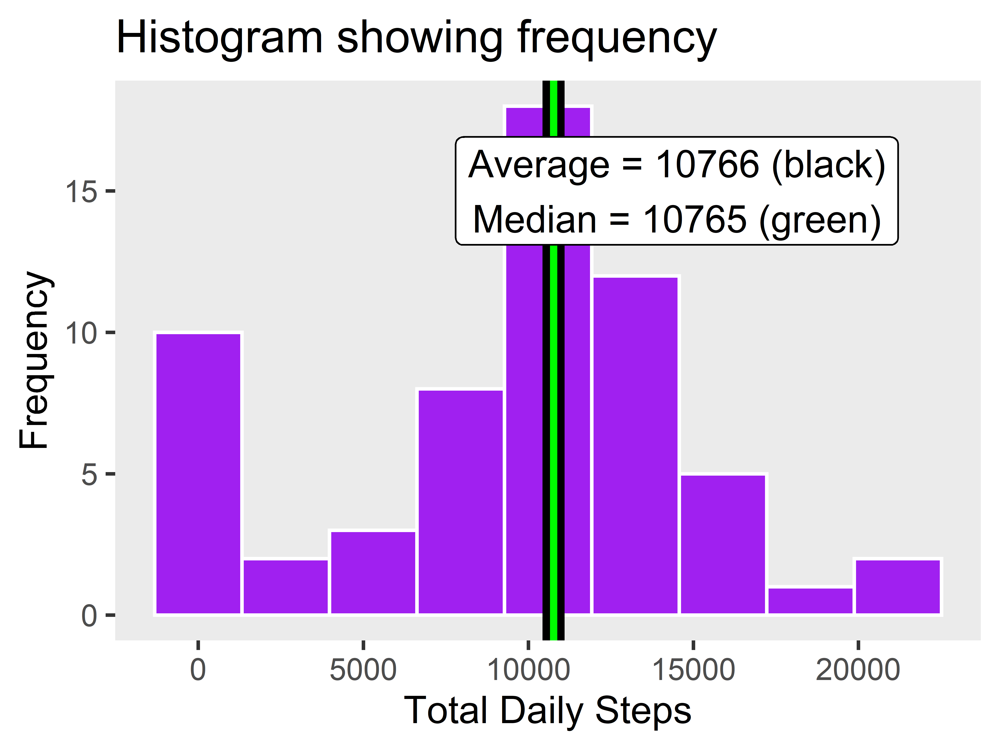
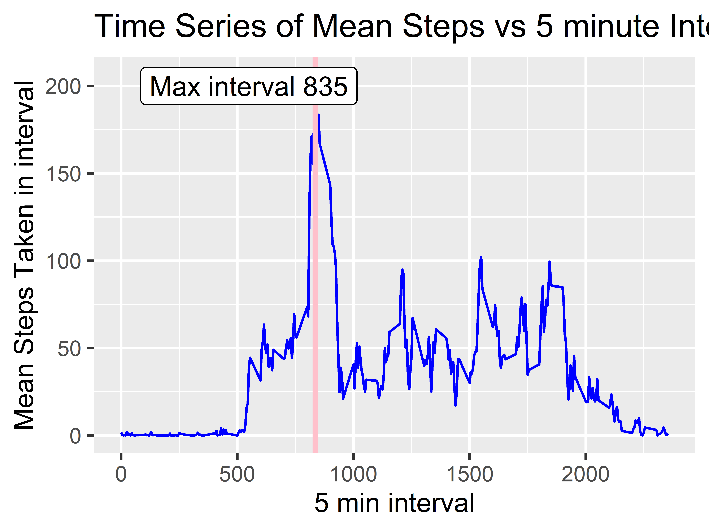
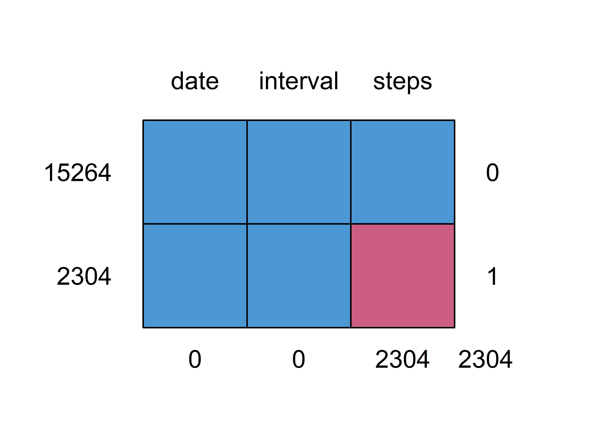
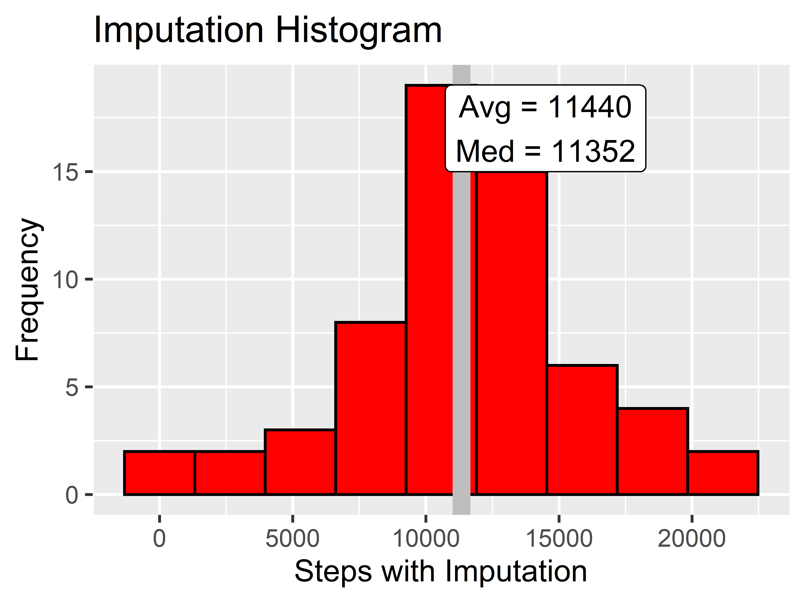
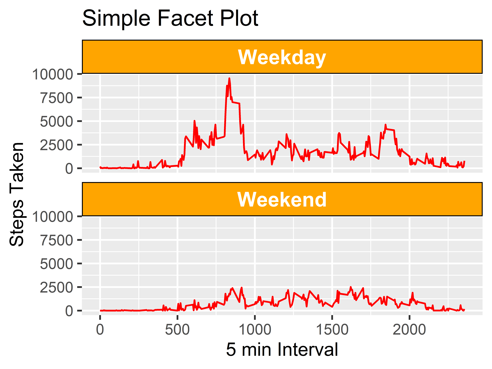

## Loading and preprocessing the data


```r
library(tidyverse)
library(lubridate)

data <-  read.csv("activity.csv") %>% 
  as_tibble %>% 
  mutate(date = ymd(date)) %>%
  relocate(date, interval, steps)
```

## What is mean total number of steps taken per day?

This one is a bit tricky but with some logic we can get the correct answer. Here
I will use the sum function to make things more clear. The logic is to sum the 
number of steps taken in all the days then divide by the total number of days. 
We can arrive at the solution quicker than the code below. But to help others I 
will go about it in a more traditional,slightly longer approach.

```r
#if you look at the dataset, there are some days which do not have ANY
#data at all! For example, we see that the first day of every month is nothing
#but ENTIRELY NA values. Thus these days shouldn't count in the mean
nadf <- data %>% filter(is.na(steps))

#if you look at the dataframe below you see there are 8 days of completely
#missing data!!
groupedna <- nadf %>% group_by(date) %>% summarise(sumna = sum(is.na(steps)))

#lets get how many total days where there is data (61 - 8 = 53 days)
ndays <- length(unique(data$date)) - nrow(groupedna)

#now lets group by the date and then sum making sure to ignore NA values
grouped <- data %>% group_by(date) %>% 
  summarise(sum_daily_steps = sum(steps, na.rm = TRUE))

#Not done yet! The above data frame returns the sum of the steps for each
#day of the month. The total steps taken across this data set would be the sum 
#of the grouped data frame
total_steps <- sum(grouped$sum_daily_steps)


#finally the average is the total steps divided by the total number of days
#answer is 10766
avg <- total_steps/ndays

#median is another tricky one and most people will get it wrong. Again,
#there are 8 complete days of missing data and should not be included
#running the command below would give the wrong answer.
#med <- median(grouped$sum_daily_steps)


#notice that in the grouped data frame I have zero's. How is the possible?
#this is because summing a vector of ALL NA values with na.rm = TRUE produces
#the value 0. If you don't believe me then run the command
#sum(c(NA,NA,NA), na.rm = TRUE) and see what you get.

#answer is 10765
med <- median((grouped %>% filter(sum_daily_steps != 0))$sum_daily_steps)


#histogram is made with ggplot
ggplot(data = grouped, aes(x = sum_daily_steps)) + 
    geom_histogram(bins = 9, color = "white", fill = "purple") +
    labs(title = "Histogram showing frequency", x = "Total Daily Steps",
         y = "Frequency") +
    theme(panel.grid.major = element_blank(), 
          panel.grid.minor = element_blank()) +
    geom_vline(mapping = aes(xintercept = avg), color = "black", size = 3) +
    geom_vline(mapping = aes(xintercept = med), color = "green", size = 1) +
    geom_label(label = "Average = 10766 (black)\nMedian = 10765 (green)", 
               y = 15, x = 14500)
```

<!-- -->
We see that the average and median is roughly in the center of the histogram.
The key here was knowing how to handle missing values.

This next part how we can easily use the arrange function to get the max steps
and plot it as an annotation on the graph.

## What is the average daily activity pattern?


```r
int_grouped <- data %>%  group_by(interval) %>%
  summarise(meanint = mean(steps, na.rm = TRUE))

#we want the interval with the maximum number of steps
orderdf <- int_grouped %>% arrange(desc(meanint))
max_interval <- orderdf[[1,1]]

ggplot(data = int_grouped) + 
  geom_line(mapping = aes(x = interval, y = meanint), color = "blue") +
  geom_vline(mapping = aes(xintercept = max_interval), color = 
               "pink", size = 1) +
  geom_label(label = "Max interval 835", y = 200, x = 550) +
  labs(x = "5 min interval", y = "Mean Steps Taken in interval",
       title = "Time Series of Mean Steps vs 5 minute Interval")
```

<!-- -->

The max interval is clearly 835.

There are many ways to imput missing data, here we use a more complicated
approach using the MICE package. Here we use 'pmm' which means predictive
mean matching. 

## Imputing missing values


```r
library(mice)

#need to know how many missing values there are
#from question 1 we saw there are 8 days of missing values, and each day has 288
#entries so the answer is 288*8 = 2304
nacount <- sum(is.na(data$steps))

#we can also see it with md.pattern from mice package
md.pattern(data)
```

<!-- -->

```r
#the assignment said not to get complicated... but nah, I want to make it 
#complicated. Let's imput the missing values using the Multiple Imputation
#by Chained Equations algorithm (MICE)
imputed <- mice(data, m = 3, method = "pmm", seed = 101)
completed <- complete(imputed, 1)

grouped_complete <- completed %>% group_by(date) %>% 
  summarise(sumsteps = sum(steps))

avg_complete <- mean(grouped_complete$sumsteps)
med_complete <- median(grouped_complete$sumsteps)


ggplot(data = grouped_complete) +
  geom_histogram(
    mapping = aes(x = sumsteps),
    bins = 9,
    color = "black",
    fill = "red") +
  labs(x = "Steps with Imputation", y = "Frequency", title = 
         "Imputation Histogram") +
  geom_vline(mapping = aes(xintercept = avg_complete), 
             color = "grey", size = 3) +
  geom_label(label = "Avg = 11440\nMed = 11352", x = 14500, y = 17)
```

<!-- -->

We can see that the average and mean are higher due to imputation.


For this next part we make a simple function called map_it to make the factor
variables.

## Are there differences in activity patterns between weekdays and weekends?

```r
#Simple
map_it <- function(x){
  week_end <- c("Saturday", "Sunday")
  ifelse(weekdays(x) %in% week_end, "Weekend", "Weekday")
}

weekday_df <- completed %>% as_tibble %>% 
  mutate(type = as.factor(map_it(date))) %>% 
  group_by(interval, type) %>% summarise(sumsteps = sum(steps))


ggplot(data = weekday_df) +
  geom_line(mapping = aes(x = interval, y = sumsteps), color = "red") +
  facet_wrap(~type, nrow = 2) + 
  labs(x = "5 min Interval", y = "Steps Taken", title = "Simple Facet Plot") +
  theme(
    strip.text.x = element_text(size = 12, color = "white", face = "bold"),
    strip.background = element_rect(color = "black", fill = "orange")
  )
```

<!-- -->
Here we can clearly see that people are lazy on weekends.
